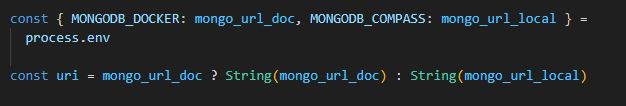
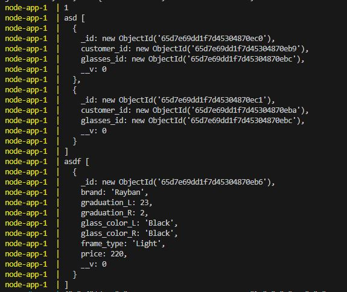

# MongoDB

Todos los comandos posibles:

`npm run mongo` Ejecuta las consulta noSQL de mongoose.

`npm run eslint` Ejecuta eslint.

Se ha utilizado dos métodos de trabajo para apreciar la facilidad de cada uno, consulta con la configuarcion en local/linea de mongoDB y el uso de imagenes preconfiguradas de Docker.

## Estructura de MongoDB

MongoDb es una base de datos noSQL( no relacional), que permite almacenar los datos de manera muy dinámica como si objetos fuesen mediante colleciones y los datos, llamados documentos.

En este ejercicios, hemos utilizado mongoose, un ODM, de MongoDB que nos permite mediantes sus métodos acceder de manera sencilla a MongoDB.

:warning: Tener la url de conexión, yo puse la propia de un cluster de mongoDBAtlas, se puede utilizar la de localhost que te da MongoDB Compass + MongoDB. :warning:

Mediante la siguiente foto, tenemos que crear las posibles datos que pudiera haber:


## Docker

Por que utilizar docker? Docker es una plataforma de código abierto que nos permitirá ejecutar una app, en nuestro caso hacer consulta a MongoDB sin tener que instalar ni MongoDB, lo conseguiremos mediante imágenes y contenedores.

:warning: Tener Docker Desktop instalado y configurado. :warning:

Guarda la imagen que contiene la config de mongo y desde donde nos conectaremos:

```sh
docker pull mongo:6-jammy
```

Ya tenemos descarga la imagen que contiene la applicación y configuracion de mongoDb, versión 6-jammy, ahora toca configurar lo más importante, el `docker-compose.yml`, que nos dirá la configuracion de los contenedores y su relación:

```yml
version: "3.8"

services:
  node-app:
    build: .
    image: hola:latest
    environment:
      - MONGODB_DOCKER=mongodb://mongodb:27017/node-boilerplate
    ports:
      - "8085:8085"
    depends_on:
      - mongodb
    volumes:
      - .:/src
    networks:
      - node-network

  mongodb:
    image: mongo:6-jammy
    ports:
      - "27017:27017"
    volumes:
      - dbdata6:/data/db
    networks:
      - node-network

volumes:
  dbdata6:

networks:
  node-network:
    driver: bridge
```

Comando para arrancar nuestras imagenes en diferentes contenedores y que queden conectados:

```sh
docker compose up
```

Para salir de la ejecución `ctrl + C`

La magia radica en que la ruta está guardada una en el file .env y el otro en el docker-compose.yml que solo existirá cuando se ejecute el compose, asi, si ejecutamos ejecutamos el archivo `mongoose.ts`, solo detectará las variables de entorno del .env:



El resultado de uno o el otro no cambiará, pues ambos utilizan mongoDB con mongoose, pero con Docker siempre tendremos el mismo entorno de desarrollo escrito en el `compose.yml` y siempre de manera virtual, sin importar las características locales e individuales.


